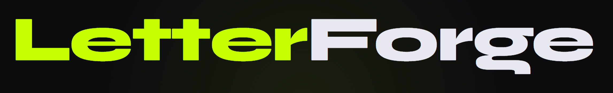
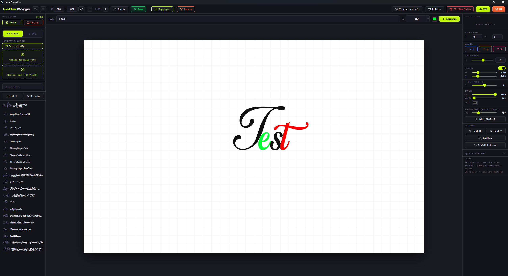
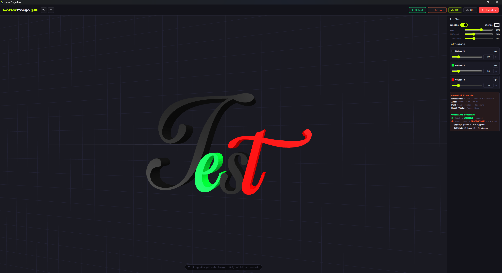

# LetterForge Pro – Desktop

[](https://github.com/S1mone01/LetterForge/releases/latest)
[](https://github.com/S1mone01/LetterForge/releases)

**LetterForge Pro** è un editor tipografico SVG e 3D per desktop per creare, manipolare ed esportare lettere, logo e modelli 3D stampabili. Costruito con Electron.

> 🎨 **Editor visivo intuitivo** · 🔤 **Gestione font avanzata** · ⬡ **Libreria SVG** · 🧊 **Operazioni booleane 3D** · 🤖 **AI-Ready (MCP)** · 💾 **Esportazione SVG/STL/3MF**



---

## ✨ Caratteristiche

- **Editor Canvas**: griglia, guide di allineamento, snap-to-guide
- **Trasformazioni complete**: posizione, rotazione, scala, inclinazione
- **Multi-select**: manipola più elementi contemporaneamente
- **Gestione Font**: supporto .ttf, .otf, .woff, .woff2
- **Libreria SVG**: importa e usa elementi SVG come asset
- **3D Preview**: anteprima 3D con operazioni booleane (unione, sottrazione)
- **OpenJSCAD Integration**: mesh watertight per stampa 3D
- **AI Integration (MCP)**: server Model Context Protocol integrato per controllo via AI
- **Esportazione**: SVG, STL, 3MF (ottimizzato per Bambu Studio)
- **Undo/Redo**: cronologia completa delle operazioni
- **Salva/Carica Progetto**: ripristina lo stato completo del workspace
- **Auto-Update**: aggiornamento automatico all'avvio

---

## 📸 Screenshot

### Editor 2D



### Anteprima 3D



---

## 🚀 Installazione

### Download
👉 **[GitHub Releases](https://github.com/S1mone01/LetterForge/releases/latest)**

### Sviluppo

```bash
git clone https://github.com/S1mone01/LetterForge.git
cd LetterForge
npm install
npm start
```

### Comandi Disponibili

| Comando | Descrizione |
|---------|-------------|
| `npm start` | Avvia in modalità sviluppo |
| `npm run build:win` | Crea installer Windows (.exe) |
| `npm run build:mac` | Crea DMG per macOS |
| `npm run build:linux` | Crea AppImage per Linux |
| `npm run release` | Build + publish su GitHub (richiede GITHUB_TOKEN) |

---

## 📖 Guida Rapida

### AI Integration (MCP)
LetterForge Pro include un server **Model Context Protocol (MCP)** sulla porta `3100`. Questo permette a client AI esterni (come Claude Desktop o Gemini CLI) di:
- Leggere lo stato del canvas
- Aggiungere testo e SVG programmaticamente
- Spostare, scalare e ricolorare elementi

### Scorciatoie da Tastiera

| Scorciatoia | Azione |
|-------------|--------|
| `Ctrl+Z` / `Ctrl+Y` | Annulla / Ripristina |
| `Spazio+Drag` | Pan canvas |
| `Shift+Click` | Multi-select |
| `Y` | Attiva/disattiva snap |
| `Ctrl+A` | Seleziona tutto |
| `Ctrl+D` | Duplica selezione |
| `Canc/Backspace` | Elimina selezionati |
| `Ctrl++/-` | Zoom in/out |
| `Ctrl+0` | Reset zoom |
| `Frecce direzionali` | Muovi selezione (1px, 10px con Shift) |

### Esportazione 3D

1. Aggiungi testo o elementi SVG
2. Apri anteprima 3D
3. Seleziona 2 elementi (Shift+click)
4. Clicca **Union** o **Subtract**
5. Esporta come STL o 3MF per stampa 3D

---

## 📂 Struttura del Progetto

```
LetterForge/
├── main.js              # Electron main process (IPC, auto-update)
├── preload.js           # Preload script (contextBridge)
├── mcp-server.js        # Model Context Protocol Server (Port 3100)
├── package.json         # Configurazione progetto e build
├── src/
│   ├── index.html       # UI renderer
│   ├── splash.html      # Splash screen di caricamento
│   ├── styles.css       # Stili CSS
│   ├── script/          # Logica applicativa (script.js, OpenJSCAD.js)
│   └── librerie/        # Dipendenze locali (three.js, opentype.js)
├── assets/              # Icone app
└── GEMINI.md            # Documentazione tecnica e contesto AI
```

**Nota**: In produzione, font e SVG utente sono salvati in `%APPDATA%/LetterForge Pro/` (Windows) e migrati automaticamente dagli aggiornamenti.

---

## 🛠️ Tecnologie

- **Runtime**: Electron 29.x
- **3D/CSG Engine**: OpenJSCAD (@jscad/modeling) + Manifold3D
- **3D Rendering**: Three.js + three-bvh-csg
- **Font Parsing**: opentype.js
- **Build Tool**: electron-builder
- **State Management**: Oggetto globale `S` (vanilla JS)

---

## 📚 Documentazione

| File | Descrizione |
|------|-------------|
| [`README.md`](README.md) | Panoramica del progetto |
| [`GEMINI.md`](GEMINI.md) | Architettura, integrazione MCP, convenzioni di sviluppo |

---

*Versione corrente: 4.3.5*
